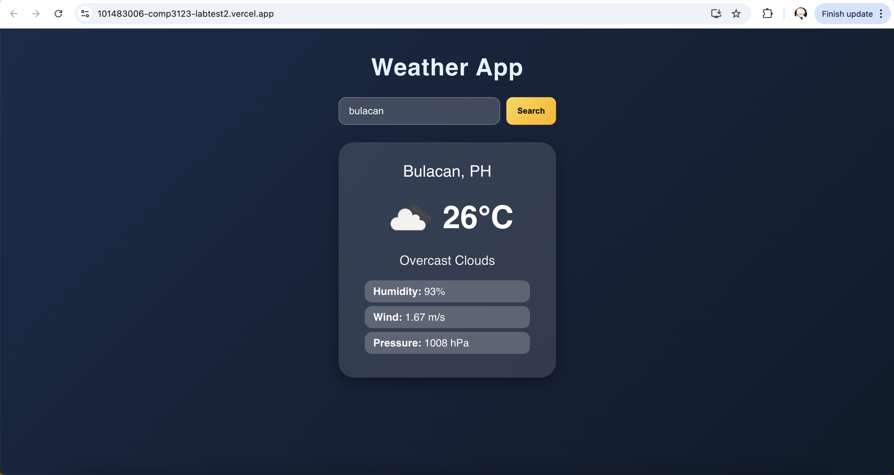
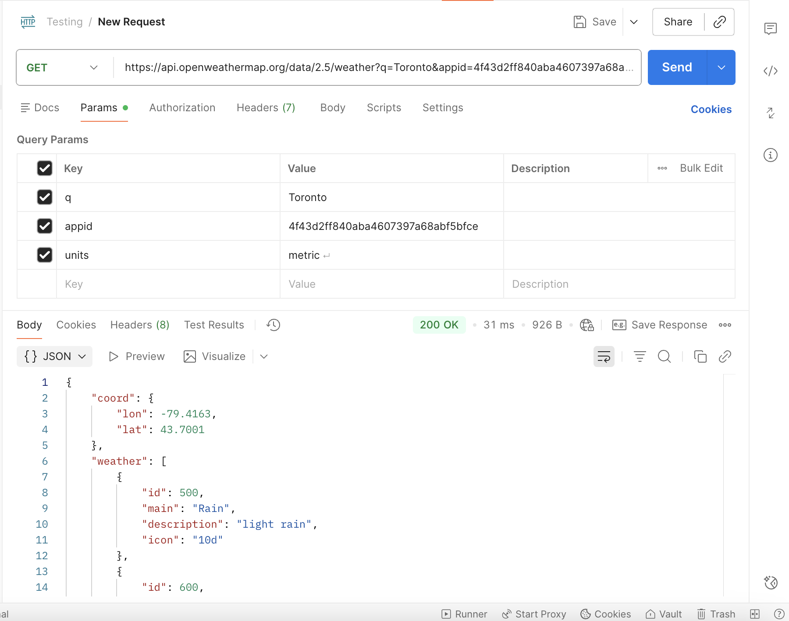

# Weather App – COMP3123 Lab Test 2
Student ID: 101483006  
Course: COMP3123
Lab Test 2 – React Weather Application

---

## Project Description
This is a React weather application that displays real-time weather information for any city using the OpenWeatherMap API.  
The user can:
- Search for any city
- View temperature, weather condition, icon, humidity, wind speed, and pressure
- Use a clean and responsive UI

This project demonstrates:
- React components
- Props and state
- useEffect lifecycle
- API integration with Axios
- Event handling
- UI/UX styling

---

## API Used
OpenWeatherMap – Current Weather API

API Pattern
```
https://api.openweathermap.org/data/2.5/weather?q={city}&appid={API_KEY}&units=metric
```

My API key is active and tested.

---

## How to Run the Project
Install dependencies:
```
npm install
```

Run the application:
```
npm start
```

App runs on:
```
http://localhost:3000
```

---

## Project Structure
```
src/
  components/
    WeatherCard.js
    SearchBar.js
  App.js
  App.css
  index.js
  weather_api_output.json
```

---

## Hosting Link

```
https://101483006-comp3123-labtest2.vercel.app/
```

---

## Screenshots (Required for Submission)

### 1. Toronto Weather (Default)
File: `toronto.png`  


### 2. Bulacan Weather (Search)
File: `bulacan.png`  


### 3. Postman API Test
File: `postman.png`  


### 4. Browser JSON Response
File: `url.png`  


### 5. Terminal Running `npm start`
File: `npmstart.png`  


### 6. Vercel Hosting
File: `vercel.png`  


---

## Submission Checklist
- [x] ZIP file without `node_modules`
- [x] README.md with screenshots
- [x] Postman screenshot
- [x] GitHub link
- [x] Hosted link (Vercel/Render/Railway)
- [x] Working search feature
- [x] Real API integration
- [x] UI with weather icon and styling

